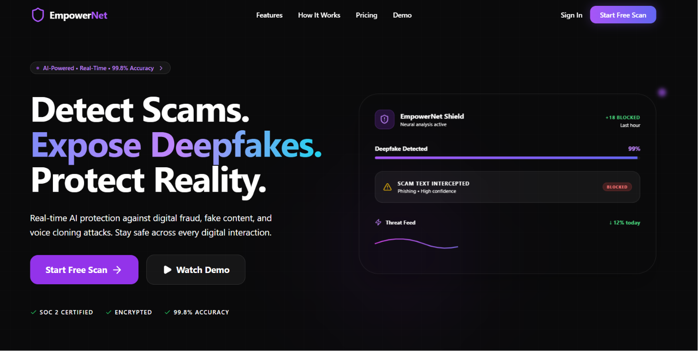
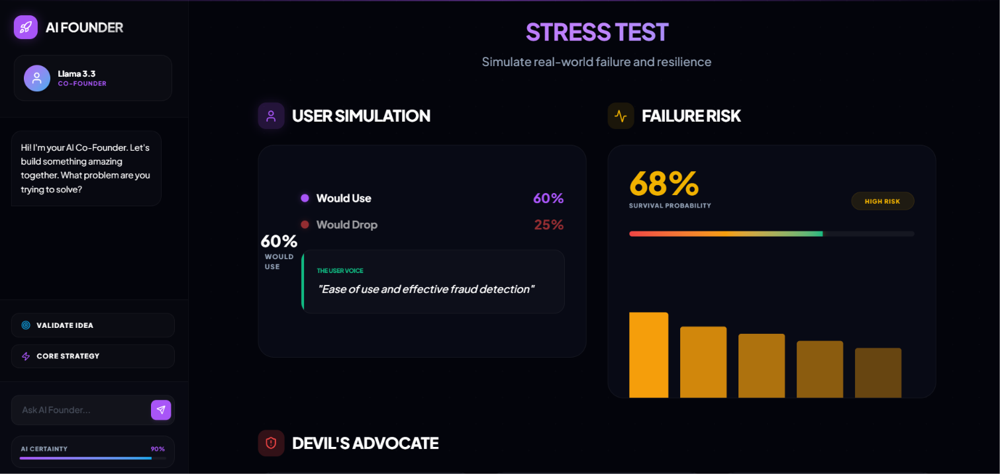
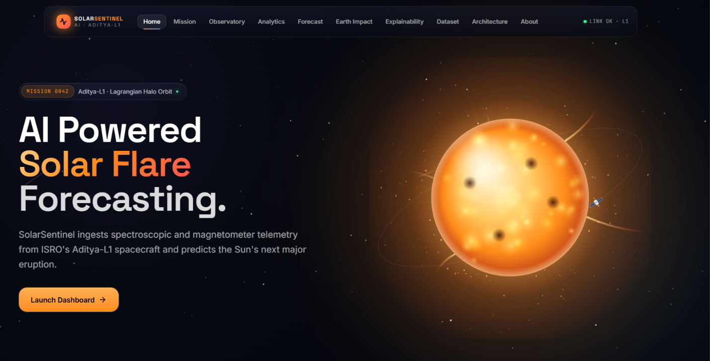

### Building full-stack applications, AI tools, and open-source projects.

  
  

  

  

---

# 🧭 Currently

- 🎓 B.Tech in Electronics & Communication Engineering (AI) @ **IGDTUW** (CGPA **9.36**)
- 💻 Building web applications using **React, Next.js, FastAPI, TypeScript, and Python**
- 🤖 Building AI-powered applications focused on solving real-world problems
- 🌱 Open Source Contributor — **GirlScript Summer of Code 2026** (16+ merged PRs)
- 🔬 Full Stack + GenAI Intern — **IGDTUW AI&DS Department / Anveshan Foundation**

---

## 🏆 Hackathon Highlights

- 🥇 **2× National Hackathon Winner** — SYNAPSE 2026 • Web of Innovation 2026
- 🥉 **HackVriksh 2025** — 2nd Runner-Up
- 🏅 **4× Top 5 Finishes** — National Online Hackathon • Hack With Ignite • TechSprint (GDG SRCASW) • Hack The Matrix
- ⚡ **20+ National Hackathons** with multiple Top 10, Top 20, and finalist finishes

> Highlights include **Build with Gemini (Top 50)**, **AVISHKAAR Season 3 (Top 50)**, **Hackureka Ni-shō (Top 10)**, and **Build-A-Thon (Top 20)**.

---

# 🚀 Projects

<table>
<tr>
<td width="50%">

### 🛡️ EmpowerNet AI

Platform for detecting scams and deepfakes across text, images, audio, and video using pretrained machine learning models. Includes a Chrome extension for browser-based analysis and a FastAPI backend for inference.

**Tech Stack**

`React` • `TypeScript` • `FastAPI` • `RoBERTa` • `EfficientNet-B5` • `MongoDB`

</td>

<td width="50%">

</td>
</tr>
</table>

---

<table>
<tr>
<td width="50%">

### 🚀 AI Co-Founder

Generates structured product plans, technical roadmaps, and market insights from startup ideas using prompt chaining and LLM inference.

**Tech Stack**

`React` • `Tailwind CSS` • `FastAPI` • `Llama 3` • `Groq API`

</td>

<td width="50%">

</td>
</tr>
</table>

---

<table>
<tr>
<td width="50%">

### ☀️ SolarSentinel AI

Space weather dashboard that processes telemetry data based on Aditya-L1 data formats to classify solar flare activity and visualize mission analytics.

**Tech Stack**

`React` • `FastAPI` • `LightGBM` • `MongoDB Atlas`

</td>

<td width="50%">

</td>
</tr>
</table>

---

# 🧰 Tech Stack

---

# 🌱 Open Source

### GirlScript Summer of Code 2026

Contributed **16+ merged pull requests** across multiple repositories involving feature development, bug fixes, and collaborative code reviews.

---

## 📈 GitHub Activity

---

### 🤝 Let's Connect

