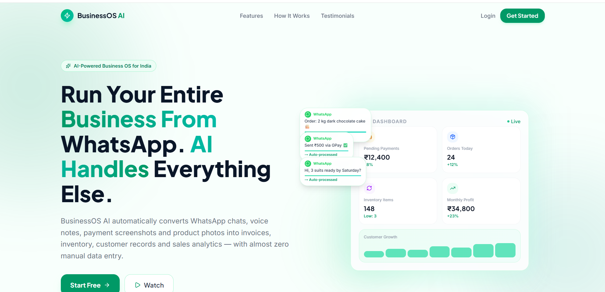
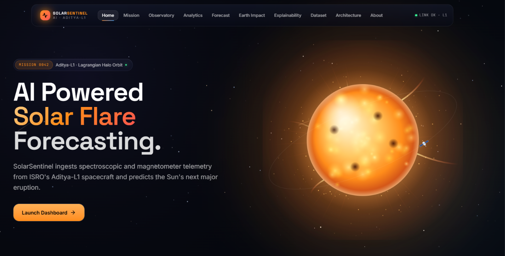
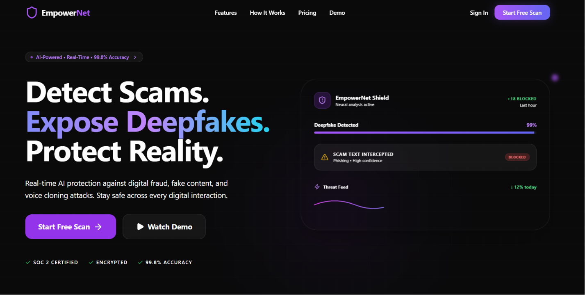

# Hi, I'm Aayushi Johri 👋

### Full-Stack Developer • AI Builder • Open Source Contributor

Building backend-heavy full-stack applications, AI systems, and open-source projects.

  
  

  

  

  

---

# 👩🏻‍💻 About Me

I'm a **second-year Electronics & Communication Engineering (AI)** student at **IGDTUW** with a **9.36 CGPA**.

I enjoy building **backend-heavy full-stack applications**, AI-powered developer tools, and scalable web platforms while actively contributing to hackathons and open source.

Currently focused on **Data Structures & Algorithms**, backend engineering, and production-ready AI systems.

---

# ⚡ Engineering Snapshot

<table>
<tr>
<td align="center" width="25%">

## 🧩 DSA

Data Structures & Algorithms

Consistently practicing problem solving & interview preparation.

</td>

<td align="center" width="25%">

## 🏆 4×

National Hackathon Winner

Multiple National-Level Podium Finishes

</td>

<td align="center" width="25%">

## 🚀 16+

Merged Pull Requests

GirlScript Summer of Code 2026

</td>

<td align="center" width="25%">

## 🎓 9.36

Current CGPA

IGDTUW • ECE-AI

</td>
</tr>
</table>

---

# 🚀 Featured Projects

<table>
<tr>
<td width="50%">

### 💬 Udhaar Wise

**WhatsApp Business Inventory & Credit Management Platform**

Backend-heavy platform for inventory, customer credit, order management, and automated payment reminders built around the **Meta WhatsApp Business API**.

**Tech Stack**

`React` • `TypeScript` • `Node.js` • `Express` • `Supabase` • `PostgreSQL`

**Highlights**

- WhatsApp Business Graph API integration.
- Customer credit & inventory services.
- Automated payment reminder workflows.
- Merchant dashboard backend.

**Achievement**

🥇 **Girls Hack Day 2026 — 1st Place**

</td>

<td width="50%">

</td>
</tr>
</table>

---

<table>
<tr>
<td width="50%">

### ☀️ SolarSentinel AI

**Space Weather Forecasting Platform**

Machine learning platform that processes telemetry data structured around **Aditya-L1 mission formats** to forecast solar flare activity and visualize mission analytics.

**Tech Stack**

`React` • `FastAPI` • `LightGBM` • `XGBoost` • `MongoDB Atlas`

**Highlights**

- Modular FastAPI backend.
- ML preprocessing pipeline.
- SHAP explainability.
- Automated testing workflow.

</td>

<td width="50%">

</td>
</tr>
</table>

---

<table>
<tr>
<td width="50%">

### 🛡️ EmpowerNet AI

**Multi-Modal Scam & Deepfake Detection Platform**

AI-powered platform for detecting scams and deepfakes across text, images, audio, and video using a FastAPI inference backend and browser-based analysis.

**Tech Stack**

`React` • `TypeScript` • `FastAPI` • `Python` • `RoBERTa` • `MongoDB`

**Highlights**

- OCR + NLP + Computer Vision pipeline.
- Evidence management backend.
- Explainable fraud reports.
- Chrome Extension prototype.

</td>

<td width="50%">

</td>
</tr>
</table>

---

# 🧰 Tech Stack

### Languages

### Frontend

### Backend

### Databases & Tools

---

# 🌱 Open Source

### GirlScript Summer of Code 2026

Contributed **16+ merged pull requests** across open-source repositories involving:

- Feature development.
- Bug fixes.
- UI improvements.
- Documentation.
- Collaborative code reviews.

---

# 🏆 Hackathon Highlights

| Achievement | Competition |
|-------------|-------------|
| 🥇 **1st Place** | Girls Hack Day 2026 |
| 🥇 **1st Place** | Web of Innovation 2026 |
| 🥇 **1st Place** | Synapse 2025 |
| 🥇 **1st Place** | ShePreneurs 2026 |
| 🥉 **3rd Place** | HackVriksh 2025 |
| 🥉 **3rd Place** | Edge Hack 2026 |
| ⭐ **Best Girls Team · 5th Place** | Hack The Matrix 2026 |

**25+ national hackathons** with multiple finalist and Top 10 finishes across AI, Full Stack, and Product Development competitions.

---

# 💼 Experience

### Full Stack + GenAI Intern

**IGDTUW AI&DS Department × Anveshan Foundation**

`June 2026 — Present`

- Building full-stack applications using React, Express, FastAPI, and MongoDB.
- Developing REST APIs and AI-powered workflows.
- Collaborating using Git and Agile development practices.

---

# 🎯 Positions of Responsibility

- **Training & Placement Coordinator** — IGDTUW *(Aug 2026 – Present)*
- **Technical & Content Coordinator** — IEEE IGDTUW.
- **Research Coordinator** — Protégé IGDTUW.

---

# 📚 Currently Learning

- Data Structures & Algorithms.
- Backend system design fundamentals.
- SQL & PostgreSQL.
- FastAPI deployment and scalable backend architecture.

---
## 📈 GitHub Activity

 

 

---

## 🤝 Let's Connect

---

Building scalable products • Learning continuously • Open to Software Engineering & AI opportunities.

